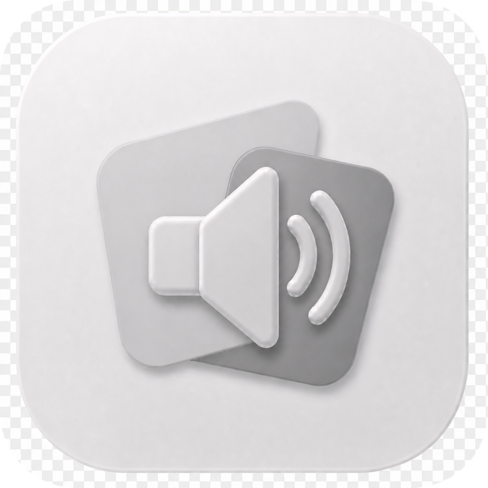
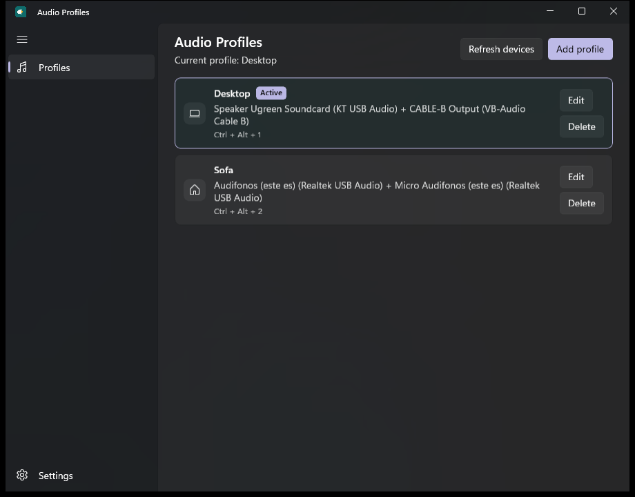

<p align="center">
  
</p>

<h1 align="center">Audio Profiles</h1>

Audio Profiles is a simple Windows 11 app for switching speakers and microphones with one click. Create a few named profiles, then tap a card, press a shortcut, or choose a profile from the tray.



## Features

- One-click profiles for speakers and microphones
- Real Windows default-device switching, not a simulation
- Optional global shortcuts such as Ctrl + Alt + 1
- Native Windows notifications after every switch
- System tray with the current profile, Open, and Exit
- Optional start with Windows, quietly in the tray
- Light, Dark, and System themes
- English and Spanish interface text
- Remembers profiles even if a device is unplugged
- In-app update check from the latest GitHub release

## Installation

Download the latest installer from the [Releases](https://github.com/neura-neura/audio-profiles/releases) page.

1. Run `AudioProfilesSetup-1.0.2.exe`.
2. Keep the default folder, or choose another per-user location.
3. On the last page, keep **Open Audio Profiles** checked if you want the app to start immediately, and optionally check **Create a desktop shortcut**.

No administrator account, Visual Studio, or .NET SDK is required. The installer is per-user and places the app in `%LOCALAPPDATA%\Audio Profiles`.

To remove it, use **Uninstall Audio Profiles** in the Start menu or Windows Settings.

## Usage

**Create a profile.** Open the app and choose **Add profile**. Give it a name, pick speakers and a microphone, optionally choose an icon, then save.

**Activate a profile.** Click the profile card. Windows switches to those devices immediately.

**Edit a profile.** Use **Edit** or **Change** on the card. You can rename it, replace a missing device, or assign a shortcut. Open **Advanced** on that page only if you need different devices for Default, Media, and Calls.

**Delete a profile.** Use **Delete**, then confirm. The profile is removed, but Windows stays on the devices it already has.

If the current Windows devices do not match any profile, the app shows **Current profile: Custom**. It never forces a profile on startup.

If a saved speaker or microphone is unplugged, the profile stays. The card shows **Not connected** so you can replace that device later.

## Keyboard Shortcuts

Each profile can have a global shortcut. On the edit page, click the shortcut box and press the keys. Use Control or Alt plus another key, for example:

- Ctrl + Alt + 1 for Desktop
- Ctrl + Alt + 2 for Sofa
- Ctrl + Alt + 3 for VR

Shortcuts keep working when the window is minimized, another app is focused, or Audio Profiles is only in the tray.

If Windows or another app already owns that combination, Audio Profiles asks you to choose another one.

## Windows Notifications

After a successful switch you get a short toast, for example:

**Desktop activated**

Output: Desktop Speakers  
Input: Desktop Microphone

If a device is missing, the toast explains the failure or partial success. The completed half of the switch is kept.

Turn notifications off in Settings with **Show notifications when switching profiles**. Switching still works.

## System Tray

By default, closing the window keeps Audio Profiles running in the background so shortcuts and hardware monitoring stay active.

Right-click the tray icon to:

- See and activate any profile
- Open the window
- Exit the app completely

Left-click the icon to open the window.

## Settings

- **Theme:** System, Light, or Dark
- **Start Audio Profiles with Windows:** off by default; when on, the app can start quietly in the tray
- **Keep running in background when window is closed:** on by default
- **Show notifications when switching profiles:** on by default
- **Start minimized in the tray:** optional
- **Advanced:** optional detailed logs, and per-role speaker/microphone assignment for a selected profile
- **Check for updates:** looks at the latest GitHub release and can download the installer to replace this copy

## Building from Source

Requirements:

- Windows 11, 64-bit
- .NET 10 SDK
- Windows App SDK workload used by the WinUI 3 project
- [NSIS 3](https://nsis.sourceforge.io/) to build the installer

Debug:

```powershell
dotnet build src\AudioProfiles\AudioProfiles.csproj -c Debug -p:Platform=x64
```

Release:

```powershell
dotnet build src\AudioProfiles\AudioProfiles.csproj -c Release -p:Platform=x64
```

Publish and installer:

```powershell
powershell -ExecutionPolicy Bypass -File tools\build-installer.ps1
```

The finished installer is written to `dist\AudioProfilesSetup-1.0.2.exe`.

You can also confirm real device switching with:

```powershell
.\src\AudioProfiles\bin\x64\Release\net10.0-windows10.0.26100.0\win-x64\AudioProfiles.exe --self-test
```

## Architecture

The app is an unpackaged, self-contained WinUI 3 desktop app.

| Area | Role |
| --- | --- |
| Profiles UI | One-click cards, first-run empty state, edit page |
| Audio device service | Enumerates endpoints and listens for hardware changes |
| Audio switching | Sets the Windows default input and output |
| Settings store | JSON profiles and preferences under `%LOCALAPPDATA%\AudioProfiles` |
| Hotkeys | Win32 `RegisterHotKey` on a hidden message window |
| Notifications | Unpackaged Windows App SDK toasts |
| Tray | Notify-icon menu for profiles, Open, and Exit |
| Startup | Optional per-user Start Menu startup shortcut |

## Technical Notes

Windows can list default audio endpoints through Core Audio / MMDevice. Setting the default endpoint uses the supported PolicyConfig COM interface, isolated inside the audio interop layer. By default a profile applies the same speaker and microphone to Console, Multimedia, and Communications. Optional per-role devices live in each profile's Advanced section.

The shipping package is an NSIS per-user installer rather than MSIX so a regular user can install it without a trusted code-signing certificate.

Diagnostic logs are written to `%LOCALAPPDATA%\AudioProfiles\logs\audio-profiles.log`.

## License

MIT. See [LICENSE](LICENSE).

## Author

Created by [neura-neura](https://github.com/neura-neura). The in-app author link and source live at [neura-neura/audio-profiles](https://github.com/neura-neura/audio-profiles).
